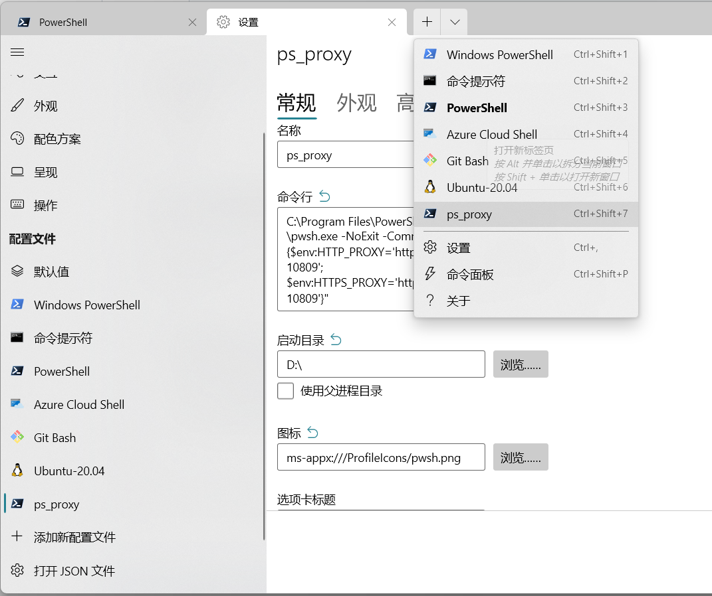

> 问题： 在使用一些代理工具开启代理之后，windows 系统的命令行工具，诸如 terminal, cmd, powershell 默认是不会走代理，需要在环境变量中配置http/https 代理地址，但是有时候不是一直开着代理在跑，有时候也需要不开代理跑命令行，我又不想再设置一下环境变量，那怎么办呢？

可以在 Windows Terminal 上面新建一个配置, 在这个配置中默认开启代理，这样当我需要代理的时候，直接打开这个 Tab 弹出的命令行就可以直接使用了。

所以我们可以这样复制一个 Powershell 的配置(其他命令行类似)，然后在启动命令中加入配置代理：

```json
{
    "commandline": "C:\\Program Files\\PowerShell\\7\\pwsh.exe -NoExit -Command \"& {$env:HTTP_PROXY='http://127.0.0.1:10809';$env:HTTPS_PROXY='http://127.0.0.1:10809'}\" ",
    "guid": "{91dcdcec-b2d8-4317-9e87-2000791226b3}",
    "hidden": false,
    "icon": "ms-appx:///ProfileIcons/pwsh.png",
    "name": "ps_proxy",
    "startingDirectory": "D:\\"
}

```

其中 `$env:HTTP_PROXY='http://127.0.0.1:10809'` 就是设置环境变量，该变量只在当前的 Powershell session 中生效，不影响其他的命令行工具，这样就能随取随用了。


