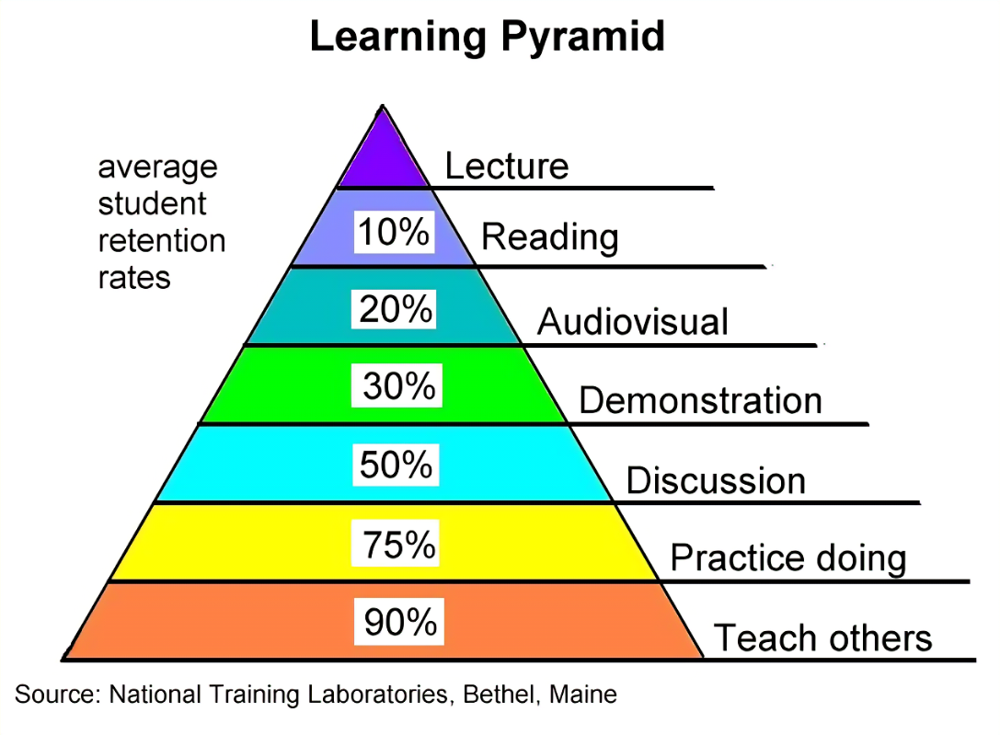

---
category:
    - 学习之道
---

# 如何高效学习

陈皓在《左耳听风》的专栏里面介绍过的一种系统学习技术的方法，我觉得很有用，在这里贴一下。

## 深度学习

学子金字塔告诉我们，主动学习能提高知识的留存率。

- 被动学习：听报告、阅读、听音频、看演示
- 主动学习：讨论、实践、教授给他人

如何深度学习：

- 高质量的信息源和第一手的知识
- 把知识连成地图，将自己的理解反述出来
- 不断地反思和思辨，与不同年龄段的人讨论
- 举一反三，并践行之，把知识转换成技能

## 系统学习的模板

学习一门技术时，多问为什么，把几个核心问题搞清楚：

::: tip 1.这个技术出现的背景、初衷和要达到什么样的目标或是要解决什么样的问题
:::
这个问题非常关键，也就是说，你在学习一个技术的时候，需要知道这个技术的成因和目标，也就是这个技术的灵魂。如果不知道这些的话，那么你会看不懂这个技术的一些设计理念。

::: tip 2.这个技术的优势和劣势分别是什么，或者说，这个技术的 trade-off 是什么
:::
任何技术都有其好坏，在解决一个问题的时候，也会带来新的问题。另外，一般来说，任何设计都有 trade-off（要什么和不要什么），所以，你要清楚这个技术的优势和劣势，以及带来的挑战。

::: tip 3.这个技术适用的场景（业务场景和技术场景）
:::
任何技术都有其适用的场景，离开了这个场景，这个技术可能会有很多槽点，所以学习技术不但要知道这个技术是什么，还要知道其适用的场景。没有任何一个技术是普适的。注意，所谓场景一般分别两个，一个是业务场景，一个是技术场景。

::: tip 4.技术的组成部分和关键点
:::
这是技术的核心思想和核心组件了，也是这个技术的灵魂所在了。学习技术的核心部分是快速掌握的关键。

::: tip 5.技术的底层原理和关键实现
:::
任何一个技术都有其底层的关键基础技术，这些关键技术很有可能也是其它技术的关键基础技术。所以，学习这些关键的基础底层技术，可以让你未来很快地掌握其它技术。

::: tip 6.已有的实现和它之间的对比
:::
一般来说，任何一个技术都会有不同的实现，不同的实现都会有不同的侧重。学习不同的实现，可以让你得到不同的想法和思路，对于开阔思维，深入细节是非常重要的。