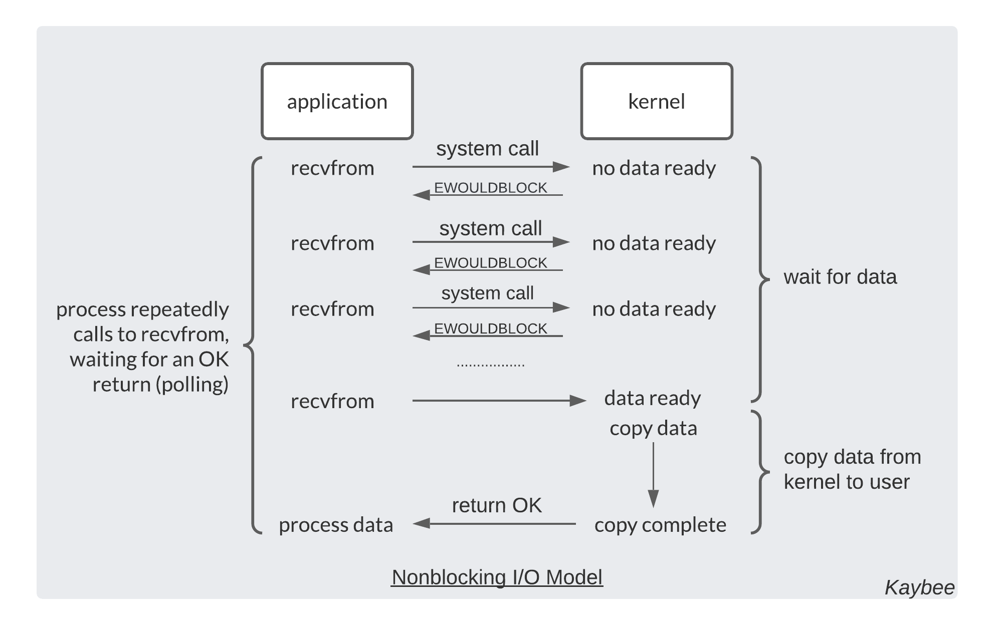
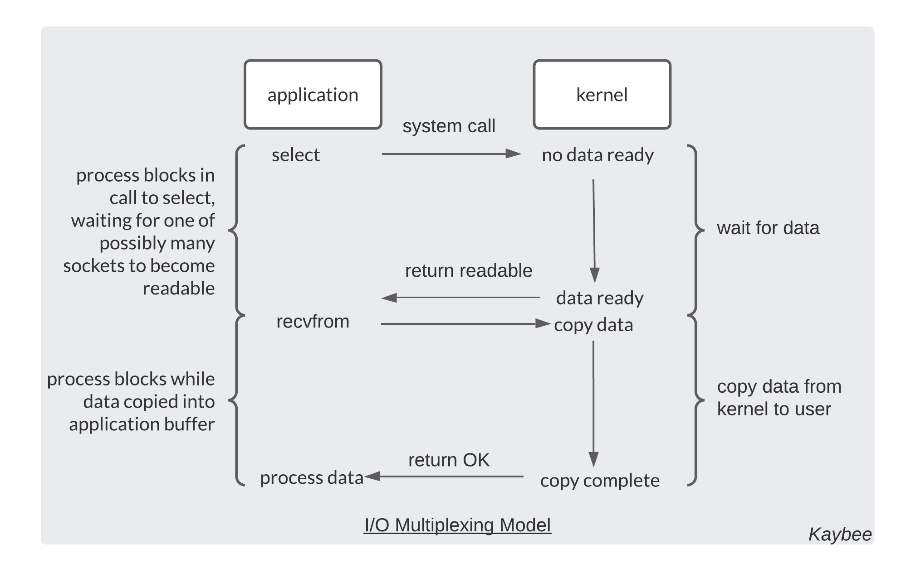
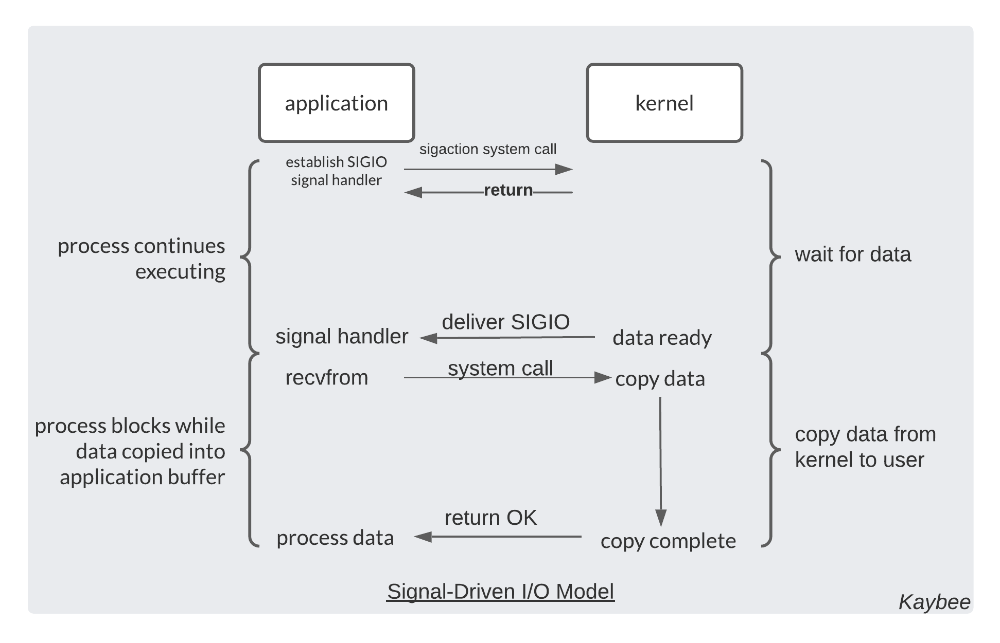
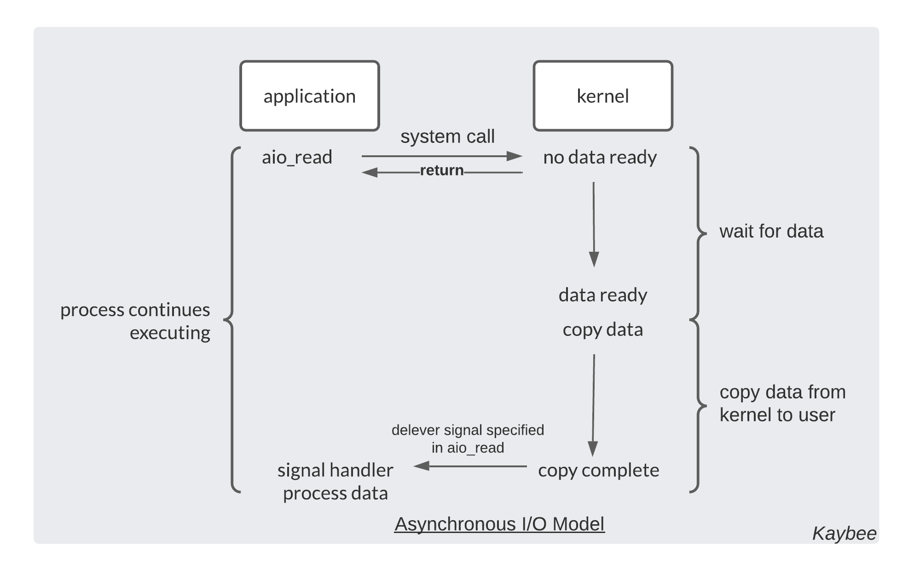

## I/O Models

在 Unix 下有 5 种 I/O 模型:

- 阻塞 I/O
- 非阻塞 I/O
- I/O 多路复用  (select and poll)
- 信号驱动的 I/O (SIGIO)
- 异步 I/O (the POSIX aio_ functions) 

> 《Unix 网络编程》中介绍了这 5 种 I/O 模型，由于该书中的示例图比较模糊，我照着画了一遍，原书中使用的是 UDP datagram 作为请求的数据，我这里统写为 data.

### 1. 阻塞 I/O - Blocking I/O

在阻塞的 I/O 模型中，发起读取调用时，应用程序阻塞在 `recvfrom`方法上，recvfrom 方法会进行系统调用读取内核空间中的数据，当数据未就绪时，则会等待数据就绪；当数据就绪时，数据会从内核空间拷贝到用户空间，当拷贝完成后，`recvfrom`方法返回，应用程序继续处理数据。在这整个过程中，recvfrom 方法和支持该方法的系统调用一直处于阻塞状态（无法返回），直到请求的数据到达内核，并从内核拷贝到了应用内存中。

### 2. 非阻塞 I/O - Nonblocking I/O

在非阻塞 I/O 中，recvfrom 方法在数据未就绪时会立即返回一个错误，并不会阻塞地等待数据就绪。一般采用循环调用 recvfrom 的方式来检查数据是否就绪，一旦数据准备好，recvfrom 方法会等待数据从内核空间拷贝到应用内存后返回。

### 3. I/O 多路复用 - I/O Multiplexing

在 I/O 多路复用的模型中，进程阻塞在 `select`或 `poll`方法上，不是真正的 I/O 系统调用(recvfrom),当数据可读时，再调用 recvfrom 方法将数据拷贝到应用内存中。与上文提到的阻塞 I/O 模型对比，I/O 多路复用需要使用2个系统调用来完成操作，但其优势在于，一个`select`方法可以监听在多个文件描述符上面，同时监听多个 I/O 是否可读。

### 4. 信号驱动的 I/O - Signal Driven I/O

在信号驱动的模型中，我们先注册一个信号处理器到系统调用 `sigaction`上，这个调用是非阻塞的，并会立即返回，应用进程可以继续处理后面的逻辑，一旦数据就绪时将会产生信号，应用进程可以通过注册的处理器读取数据或通过调用 recvfrom 读取数据。整个过程在等待数据就绪时候是非阻塞的。

### 5. 异步 I/O - Asynchronous I/O

异步 I/O 是由 POSIX 规范定义的，其工作过程是当调用异步 I/O 方法时就立即返回了，应用进程会继续去处理后面的逻辑，内核会负责整个 I/O 操作(包括等待数据就绪和将数据拷贝至应用内存中)，与信号驱动 I/O 模型的区别在于，内核在信号驱动的I/O 中会通知我们何时可以开始 I/O 操作(真正读数据，即拷贝数据)，而在异步 I/O 中内核是通知我们何时完成 I/O .

### 小结

POSIX 定义了同步和异步 I/O 的定义：
- 同步 I/O（synchronous I/O）：A synchronous I/O operation causes the requesting process to be blocked until that I/O operation completes.
- 异步 I/O（asynchronous I/O）：An asynchronous I/O operation does not cause the requesting process to be blocked.

按以上定以来说，上面前 4 种 I/O 模型(阻塞、非阻塞、I/O 多路复用、信号驱动 I/O)都属于同步 I/O，因为它们在真正的 I/O 操作过程中(recvfrom) 都会阻塞调用进程。只有最后一个模型符合 POSIX 定义的异步 I/O.