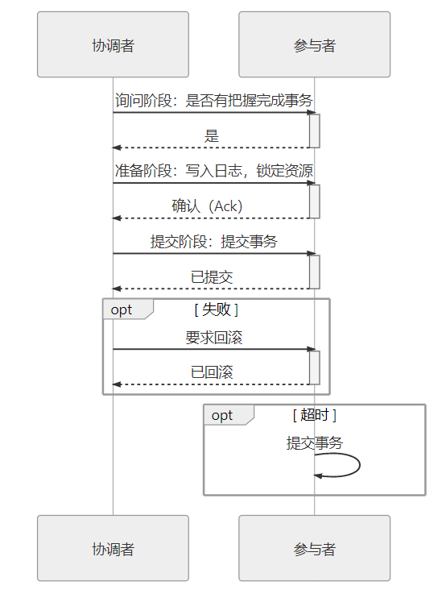
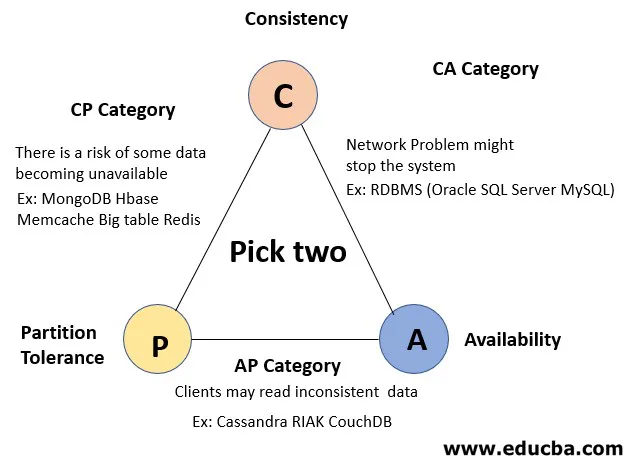
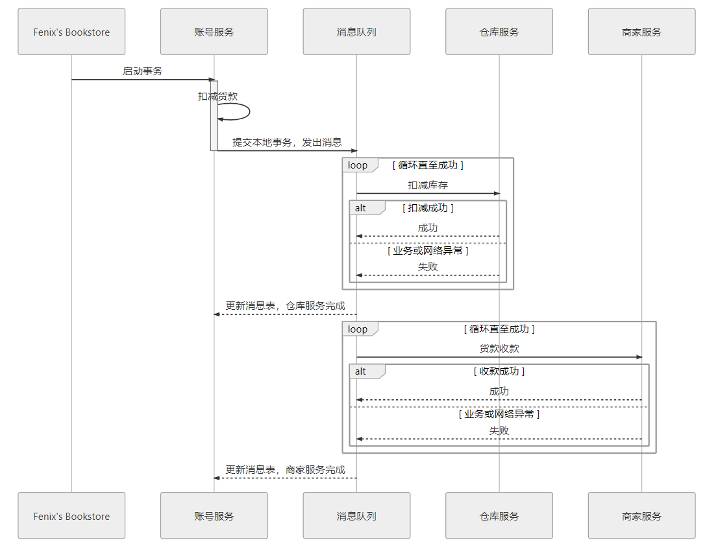
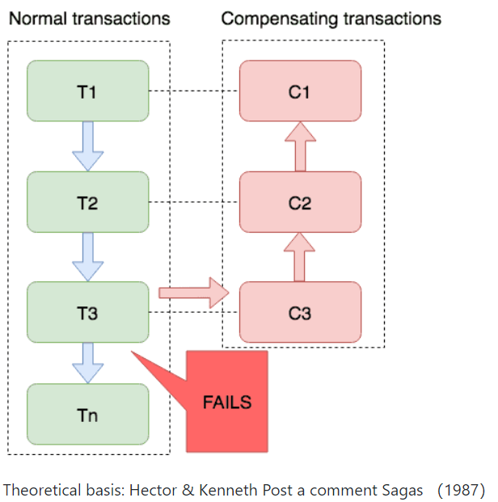

# 分布式事务

数据库事务的ACID

- Atomic 原子性：在同一项业务处理过程中，事务保证了对多个数据的修改，要么同时成功，要么同时被撤销

- Consistency 一致性：保证系统中所有的数据都是符合期望的，且相互关联的数据之间不会产生矛盾，数据一致性

- Isolation 隔离性：在不同的业务处理过程中，事务保证了各自业务正在读、写的数据互相独立，不会彼此影响

- Durability 持久性：事务应当保证所有成功被提交的数据修改都能够正确地被持久化，不丢失数据

>  AID 是手段，Consistency 是目的

## 本地事务（单个服务使用单个数据源）

本地事务是指仅操作单一事务资源的、不需要全局事务管理器进行协调的事务。本地事务是最基础的一种事务解决方案，只适用于单个服务使用单个数据源的场景，它是直接依赖于数据源本身提供的事务能力来工作的。

#### 数据库事务实现原理

[ARIES](https://en.wikipedia.org/wiki/Algorithms_for_Recovery_and_Isolation_Exploiting_Semantics)理论（Algorithms for Recovery and Isolation Exploiting Semantics，ARIES）是现代数据库的基础理论，现代的主流关系型数据库在事务实现上都深受其影响。（[Algorithms for Recovery and Isolation Exploiting Semantics - Wikipedia](https://en.wikipedia.org/wiki/Algorithms_for_Recovery_and_Isolation_Exploiting_Semantics#Logging)）

[ARIES: A Transaction Recovery Method Supporting Fine-Granularity Locking and Partial Rollbacks Using Write-Ahead Logging](https://cs.stanford.edu/people/chrismre/cs345/rl/aries.pdf)

[ARIES/KVL: A Key-Value Locking Method for Concurrency Control of Multiaction Transactions Operating on B-Tree Indexes](http://vldb.org/conf/1990/P392.PDF)


##### 原子性和持久性的实现

原子性保证了事务的多个操作要么都生效要么都不生效，不会存在中间状态；持久性保证了一旦事务生效，就不会再因为任何原因而导致其修改的内容被撤销或丢失。

> 问题：
>
> - 数据需要写入磁盘才具有持久性，但“写入磁盘”不具有原子性
> - 应用程序可能随时都会崩溃 （Crash）

由于写入磁盘的中间状态和崩溃都无法避免，那么只能在崩溃后采取恢复的补救措施，这种数据恢复操作被称为“崩溃恢复”（Crash Recovery）

**1 提交日志 - Commit Logging**

将修改数据这个操作所需的全部信息，包括修改什么数据、数据物理上位于哪个内存页和磁盘块中、从什么值改成什么值，等等，以日志的形式——即仅进行顺序追加的文件写入的形式（这是最高效的写入方式）先记录到磁盘中。只有在日志记录全部都安全落盘，数据库在日志中看到代表事务成功提交的“提交记录”（Commit Record）后，才会根据日志上的信息对真正的数据进行修改，修改完成后，再在日志中加入一条“结束记录”（End Record）表示事务已完成持久化。

> 问题：
>
> Commit Logging 要求所有对数据的真实修改都必须发生在事务提交以后，即日志写入了 Commit Record 之后。当事务修改的数据量很大时，会占用大量内存缓冲区，即使磁盘IO有足够的空闲，数据也不会提前写入磁盘，影响性能。
>
> Commit Logging 允许 NO-FORCE ，不允许 STEAL。


> 注：
>
> FORCE ：当事务提交后，要求变动数据必须同时完成写入则称为 FORCE，如果不强制变动数据必须同时完成写入则称为 NO-FORCE。现实中绝大多数数据库采用的都是 NO-FORCE 策略，因为只要有了日志，变动数据随时可以持久化，从优化磁盘 I/O 性能考虑，没有必要强制数据写入立即进行。
>
> STEAL ：在事务提交前，允许变动数据提前写入则称为 STEAL，不允许则称为 NO-STEAL。

**2 Write-Ahead Logging (WAL)**

WAL 允许在事务提交之前，提前写入变动数据，WAL 允许 NO-FORCE和 STEAL。

如果允许 STEAL，即事务提交前允许部分修改数据写入磁盘，如果事务一旦回滚或发生崩溃，提前写入的数据则成为了错误数据，如何解决？

Write-Ahead Logging 在崩溃恢复时会执行以下三个阶段的操作：

- **分析阶段**（Analysis）
- **重做阶段**（Redo）
- **回滚阶段**（Undo）

##### 隔离性的实现原理

隔离性的实现基于数据库提供的三种锁：

- **写锁**（Write Lock，也叫作排他锁，eXclusive Lock，简写为 X-Lock）：如果数据有加写锁，就只有持有写锁的事务才能对数据进行写入操作，数据加持着写锁时，其他事务不能写入数据，也不能施加读锁。
- **读锁**（Read Lock，也叫作共享锁，Shared Lock，简写为 S-Lock）：多个事务可以对同一个数据添加多个读锁，数据被加上读锁后就不能再被加上写锁，所以其他事务不能对该数据进行写入，但仍然可以读取。对于持有读锁的事务，如果该数据只有它自己一个事务加了读锁，允许直接将其升级为写锁，然后写入数据。
- **范围锁**（Range Lock）：对于某个范围直接加排他锁，在这个范围内的数据不能被写入。

**SQL 92 事务隔离级别：**

- 可串行化（Serializable）

  对事务所有读、写的数据全都加上读锁、写锁和范围锁即可做到可串行化

- 可重复读（Repeatable Read）

  对事务所涉及的数据加读锁和写锁，且一直持有至事务结束，但不再加范围锁。

- 读已提交（Read Committed）

  对事务涉及的数据加的写锁会一直持续到事务结束，但加的读锁在查询操作完成后就马上会释放。

- 读未提交（Read Uncommitted）

  对事务涉及的数据只加写锁，会一直持续到事务结束，但完全不加读锁。

**不同隔离级别以及幻读、不可重复读、脏读等问题都只是表面现象，是各种锁在不同加锁时间上组合应用所产生的结果，以锁为手段来实现隔离性才是数据库表现出不同隔离级别的根本原因。**

> 幻读（Phantom Reads）：指在事务执行过程中，两个完全相同的范围查询得到了不同的结果集。
>
> 不可重复读（Non-Repeatable Reads）：指在事务执行过程中，对同一行数据的两次查询得到了不同的结果。
>
> 脏读（Dirty Reads）：指在事务执行过程中，一个事务读取到了另一个事务未提交的数据。

**多版本并发控制 MVCC**

Multi-Version Concurrency Control 是一种无锁的并发控制方案，因为不同事务之间产生问题的场景是“一个事务在读 + 另一个事务在写”（读 + 写），MVCC 的思路就是针对数据库的任何修改都不会直接覆盖之前的数据，而是产生一个新版本与老版本共存，以此来达到无锁的目的。

其具体实现可以理解为，为数据库中的每一行记录都有2个隐藏的字段：CREATE_VERSION 和 DELETE_VERSION，这2个字段都是事务 ID，事务 ID 是一个全局严格递增的数值，每开始一个事务时该版本号都会递增。

- 插入数据时：CREATE_VERSION 记录插入数据的事务 ID，DELETE_VERSION 为空

- 删除数据时：DELETE_VERSION 记录删除数据的事务 ID，CREATE_VERSION 为空

- 修改数据时：将修改数据可以拆分成“删除旧数据，插入新数据”的组合，先将原有数据复制一份，将原有数据的 DELETE_VERSION 记录为修改数据事务ID，CREATE_VERSION 为空；将复制后的数据的 CREATE_VERSION 记录为修改数据的事务 ID，DELETE_VERSION 为空。
- 读取数据时：根据事务的隔离级别来决定读取哪个版本的数据：
  - 可重复读：总是读取 CREATE_VERSION 小于或等于当前的事务 ID的记录，有多个记录的话取最新的
  - 读已提交：总是读取最新的版本即可（事务ID 最大）

读未提交和串行化与MVCC 不兼容，一个只读最新的数据，一个对所有操作都加锁。

> 小结：
>
> - 主流的数据库都使用 WAL 来实现原子性和持久性
> - 数据库通过写锁、读锁和范围锁来实现不同的隔离级别，由此也会产生相应的各种问题；MVVC 无所方案主要是解决“一个事务读 + 一个事务写的”场景，在“写 + 写”的场景中，主要还是靠加锁来解决。

## 分布式事务（单个服务使用多个数据源）

> 问题：在单个服务使用多个数据源的情况下，该如何处理事务？

伪代码：

```java
public void buyProduct(PaymentBill bill) {
    userTransaction.begin();
    warehouseTransaction.begin();
    businessTransaction.begin();
	try {
        userAccountService.pay(bill.getMoney());
        warehouseService.deliver(bill.getItems());
        businessAccountService.receipt(bill.getMoney());
        userTransaction.commit();
        warehouseTransaction.commit();
        businessTransaction.commit();
	} catch(Exception e) {
        userTransaction.rollback();
        warehouseTransaction.rollback();
        businessTransaction.rollback();
	}
}
```

以上代码可以看出，一次购买商品的逻辑，由于使用了多个数据源，需要做三次事务提交，但实际上代码这样写也无法整个逻辑在一个事务之中，如果在 `businessTransaction.commit();`中出现错误，由于前2个事务已经提交，即使在 catch 去调用 `rollback()`也已无济于事，最后导致的结果就是一部分事务提交，一部分事务回滚，数据不一致。

#### XA 事务

为了解决分布式事务的一致性问题，X/Open 组织提出了名为 X/Open XA 的处理事务架构，其核心内容是定义了全局的事务管理器（Transaction Manager，用于协调全局事务）和局部的资源管理器（Resource Manager，用于驱动本地事务）之间的通信接口。Java 语言中基于 XA 模式的实现即 JTA，定义了2个接口：

- 事务管理器接口：`javax.transaction.TransactionManager`
- 满足XA 规范的资源定义接口：`javax.transaction.xa.XAResource`

##### 两阶段提交 2PC

还是上面的场景，XA 事务将提交拆分成两阶段过程，也成为**“两段式提交”（2 Phase Commit，2PC）**：


- 准备阶段（投票阶段）

  协调者询问事务的所有参与者是否准备好提交，参与者如果已经准备好提交则回复 Prepared，否则回复 Non-Prepared。对于数据库来说，准备操作是在重做日志中记录全部事务提交操作所要做的内容，它与本地事务中真正提交的区别只是暂不写入最后一条 Commit Record 而已，这意味着在做完数据持久化后并不立即释放隔离性，即仍继续持有锁，维持数据对其他非事务内观察者的隔离状态。

- 提交阶段（执行阶段）

  协调者如果在上一阶段收到所有事务参与者回复的 Prepared 消息，则先自己在本地持久化事务状态为 Commit，在此操作完成后向所有参与者发送 Commit 指令，所有参与者立即执行提交操作；否则，任意一个参与者回复了 Non-Prepared 消息，或任意一个参与者超时未回复，协调者将自己的事务状态持久化为 Abort 之后，向所有参与者发送 Abort 指令，参与者立即执行回滚操作。该过程对数据库来说是轻量级的，仅持久化一条 Commit Record而已，若是要回滚时需要清理已提交的数据才是重负载操作。

**2 PC 的缺点**：

- 单点问题

  协调者宕机的话，所有参与者都会受到影响。协调者等待参与者回复消息可以有超时机制，但是参与者等待协调者指令时无法做超时处理，一旦协调者宕机，所有参与者要一直等待。

- 性能问题

  整个事务的处理时间受限于参与者中处理最慢的那一个（木桶原理）

- 一致性风险

  2PC 成立的前提条件时网络稳定和宕机能够恢复，根据 FLP 不可能原理，如果宕机不能够恢复，那就不存在任何一种分布式协议可以正确地达成一致性结果。在 2PC的一致性风险是指，在提交阶段，协调者收到所有参与者回复 Prepared 之后，先在本地提交自己的事务，若此时协调者与参与者出现通信问题，就会出现一部分已提交，一部分未提交的数据不一致问题。

##### **三段式提交（3PC）**

三段式提交把原本的两段式提交的准备阶段再细分为两个阶段，分别称为 CanCommit、PreCommit，把提交阶段改称为 DoCommit 阶段。将准备阶段一分为二的理由是这个阶段是重负载的操作。三段式提交对单点问题和回滚时的性能问题有所改善，但是它对一致性风险问题并未有任何改进，若进入 PreCommit 阶段之后，协调者发出的指令不是 Ack 而是 Abort，而此时因网络问题，有部分参与者直至超时都未能收到协调者的 Abort 指令的话，这些参与者将会错误地提交事务，这就产生了不同参与者之间数据不一致的问题



- CanCommit

  询问阶段，协调者让每个参与的数据库根据自身状态，评估该事务是否有可能顺利完成

- PreCommit

  写重做日志。如果在 PreCommit 阶段之后发生了协调者宕机，即参与者没有能等到 DoCommit 的消息的话，默认的操作策略将是提交事务而不是回滚事务或者持续等待

- DoCommit

  提交事务

## 分布式事务（多个服务同时访问多个数据源）

### CAP 定理 

> 一个分布式系统中，涉及共享数据问题时，一致性、可用性、分区容错性三个特性最多只能同时满足其中两个.



- 一致性（Consistency）

  代表数据在任何时刻、任何分布式节点中所看到的都是符合预期的

- 可用性（Availability）

  代表系统不间断地提供服务的能力。Availability = MTBF/(MTBF+MTTR)
  

> MTBF（Mean Time Between Failure）：可靠性，平均无故障时间
> MTTR（Mean Time To Repair）：可维护性，平均可修复时间

- 分区容错性（Partition Tolerance）

  代表分布式环境中部分节点因网络原因而彼此失联后，即与其他节点形成“网络分区”时，系统仍能正确地提供服务的能力

目前选择放弃一致性的 AP 系统目前是设计分布式系统的主流选择，放弃强一致性的目标而去追求“最终一致性”（Eventually Consistency）

- 强一致性：在分布式系统中一致性的概念有所延申，在ACID 中的一致性可称为“强一致性”
- 最终一致性：如果数据在一段时间之内没有被另外的操作所更改，那它最终将会达到与强一致性过程相同的结果

相对于 ACID 所要求的强一致性，BASE 模型提出了最终一致性的方案，其缩写代表的是：

- Basic Availability
- Soft-state
- Eventual consistency

### 可靠事件队列 （BASE 理论）

最终一致性的来源是 [BASE](https://queue.acm.org/detail.cfm?id=1394128), 其中提出了可靠事件队列的做法来达到最终一致性，也有人将其称为本地消息表。

“最大努力一次提交”（Best-Effort 1PC），指的就是将最有可能出错的业务以本地事务的方式完成后，采用不断重试的方式（不限于消息系统）来促使同一个分布式事务中的其他关联业务全部完成。

**缺点**：事务没有隔离性。

> Best-Effort Delivery 最大努力交付
>
> Best-Effort 1PC 最大努力一次提交

以下示例来自于[分布式事务 | 凤凰架构 (icyfenix.cn)](http://icyfenix.cn/architect-perspective/general-architecture/transaction/distributed.html#可靠事件队列) 中购买商品的场景，这个过程使用可靠消息队列的方案来实现分布式事务：



### TCC 事务

论文：[Life beyond Distributed Transactions: an Apostate’s Opinion](https://www.ics.uci.edu/~cs223/papers/cidr07p15.pdf)

TCC 是“Try-Confirm-Cancel”三个单词的缩写，它是基于业务层面的事务定义，把事务运行过程分为 Try、Confirm/Cancel 两个阶段，每个阶段的逻辑是有业务代码来控制。每一个 Try 操作最终都会被 Confirm 或 Cancel.


- **Try**：尝试执行阶段，完成所有业务可执行性的检查（保障一致性），并且预留好全部需用到的业务资源（保障隔离性）。

- **Confirm**：确认执行阶段，不进行任何业务检查，直接使用 Try 阶段准备的资源来完成业务处理。Confirm 阶段可能会重复执行，因此本阶段所执行的操作需要具备幂等性。
- **Cancel**：取消执行阶段，释放 Try 阶段预留的业务资源。Cancel 阶段可能会重复执行，也需要满足幂等性。

**特点**：

- 让应用自己定义数据库操作的粒度，使得降低锁冲突、提高吞吐量成为可能。

- 在具体实现上，TCC 较为烦琐，它是一种业务侵入式较强的事务方案，意味着有更高的开发成本和更换事务实现方案的替换成本。
- 有较强的隔离性

### SAGA 事务

https://www.cs.cornell.edu/andru/cs711/2002fa/reading/sagas.pdf

补偿事务处理在 30 多年前就提出了 Saga 理论，随着微服务的发展，近些年才逐步受到大家的关注。目前业界比较公认的是采用 Saga 作为长事务的解决方案。



SAGA 由两部分操作组成

- 大事务拆分若干个小事务，将整个分布式事务 T 分解为 n 个子事务，命名为 T1，T2，…，Ti，…，Tn。每个子事务都应该是或者能被视为是原子行为。如果分布式事务能够正常提交，其对数据的影响（最终一致性）应与连续按顺序成功提交 Ti等价。
- 为每一个子事务设计对应的补偿动作，命名为 C1，C2，…，Ci，…，Cn。Ti与 Ci必须满足以下条件：
  - Ti与 Ci都具备幂等性。
  - Ti与 Ci满足交换律（Commutative），即先执行 Ti还是先执行 Ci，其效果都是一样的。
  - Ci必须能成功提交，即不考虑 Ci本身提交失败被回滚的情形，如出现就必须持续重试直至成功，或者要人工介入。

如果 T1到 Tn均成功提交，那事务顺利完成，否则，要采取以下两种恢复策略之一：

- **正向恢复**（Forward Recovery）：如果 Ti事务提交失败，则一直对 Ti进行重试，直至成功为止（最大努力交付）。这种恢复方式不需要补偿，适用于事务最终都要成功的场景，譬如在别人的银行账号中扣了款，就一定要给别人发货。正向恢复的执行模式为：T1，T2，…，Ti（失败），Ti（重试）…，Ti+1，…，Tn。
- **反向恢复**（Backward Recovery）：如果 Ti事务提交失败，则一直执行 Ci对 Ti进行补偿，直至成功为止（最大努力交付）。这里要求 Ci必须（在持续重试后）执行成功。反向恢复的执行模式为：T1，T2，…，Ti（失败），Ci（补偿），…，C2，C1。

与 TCC 相比，SAGA 不需要为资源设计冻结状态和撤销冻结的操作，补偿操作往往要比冻结操作容易实现得多。

**优势：**

- 一阶段提交本地事务，无锁，高性能；
- 参与者可异步执行，高吞吐；
- 补偿服务易于实现，因为一个更新操作的反向操作是比较容易理解的。

**缺点：**

- 不保证事务的隔离性。

[Seata ](https://seata.io/zh-cn/docs/overview/what-is-seata.html) AT 事务


参考：

《凤凰架构》周志明

[Saga Pattern in Microservices | Baeldung on Computer Science](https://www.baeldung.com/cs/saga-pattern-microservices)
