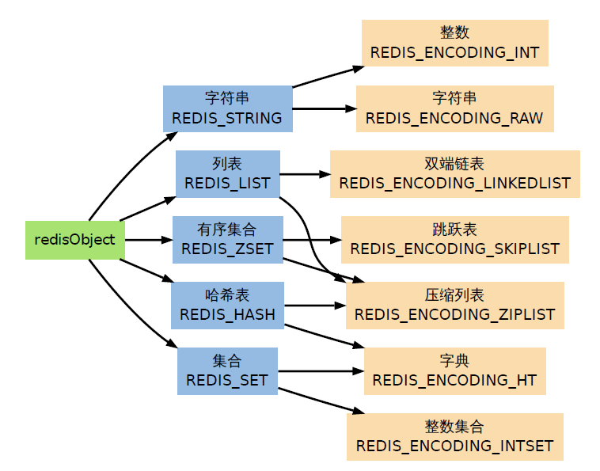
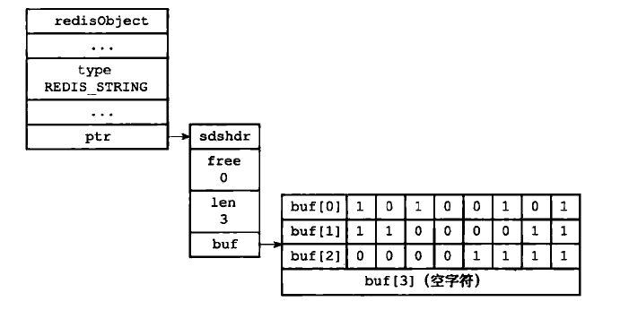
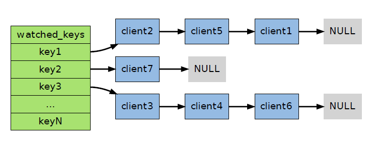
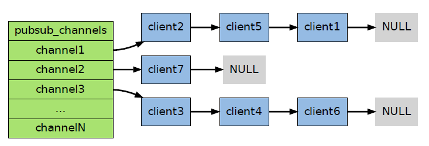
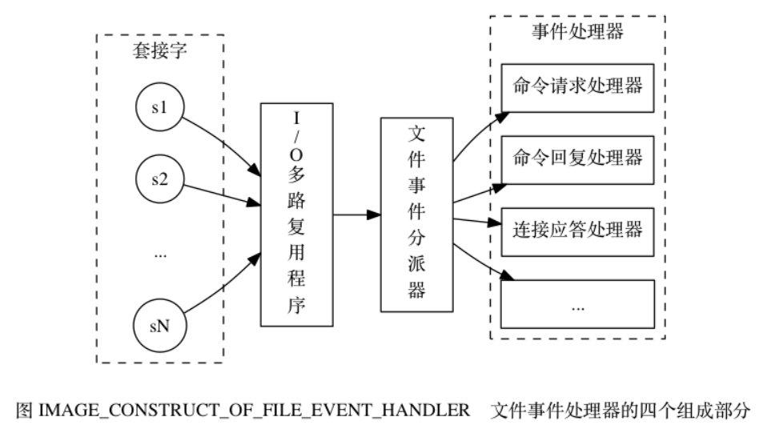
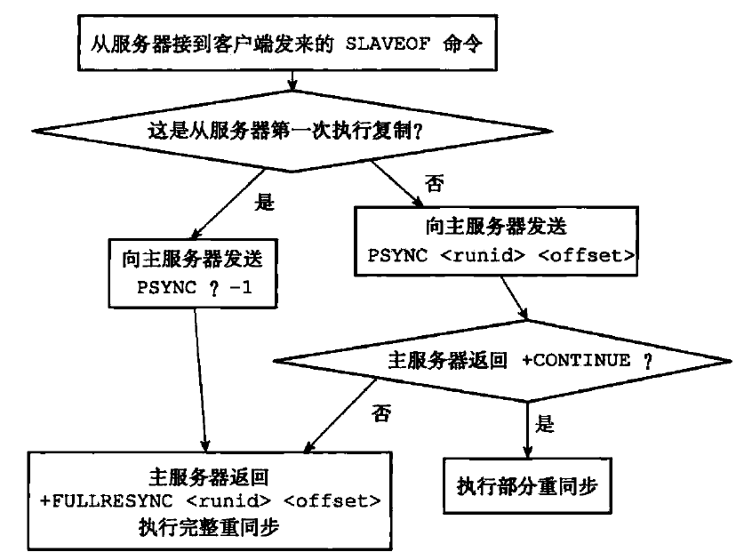
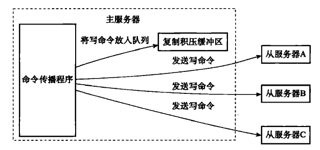
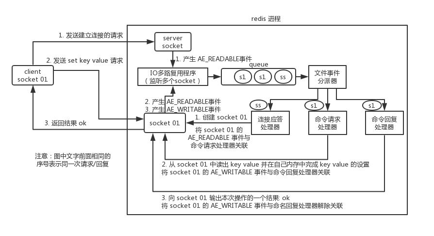

## 内部数据结构

### 简单动态字符串 Simple Dynamic String

Redis 的字符串表示为sds ，而不是C 字符串（以\0 结尾的char*）。

- 对比C 字符串，sds 有以下特性：
  - 可以高效地执行长度计算（strlen）；
  - 可以高效地执行追加操作（append）；
  - 二进制安全；
- sds 会为追加操作进行优化：加快追加操作的速度，并降低内存分配的次数，代价是多占
  用了一些内存，而且这些内存不会被主动释放。

sds 的实现

```c
typedef char *sds;

struct sdshdr {
// buf 已占用长度
int len;
// buf 剩余可用长度
int free;
// 实际保存字符串数据的地方
char buf[];
};
```


### 双端链表

- Redis 实现了自己的双端链表结构。
- 双端链表主要有两个作用：
  - 作为Redis 列表类型的底层实现之一；
  - 作为通用数据结构，被其他功能模块所使用；

- 双端链表及其节点的性能特性如下：
  - 节点带有前驱和后继指针，访问前驱节点和后继节点的复杂度为O(1) ，并且对链表
    的迭代可以在从表头到表尾和从表尾到表头两个方向进行；
  - 链表带有指向表头和表尾的指针，因此对表头和表尾进行处理的复杂度为O(1) ；
  - 链表带有记录节点数量的属性，所以可以在O(1) 复杂度内返回链表的节点数量（长
    度）；

### 字典 dict

字典是由键值对构成的抽象数据结构。

- Redis 中的数据库（key space）和哈希键都基于字典来实现。

  **key space**：Redis 是一个键值对数据库，数据库中的键值对就由字典保存：每个数据库都有一个与之相对应的字典，这个字典被称之为键空间（key space）。

- Redis 字典的底层实现为哈希表，每个字典使用两个哈希表，一般情况下只使用0 号哈希
  表，只有在rehash 进行时，才会同时使用0 号和1 号哈希表。

- 哈希表使用链地址法来解决键冲突的问题。

- Rehash 可以用于扩展或收缩哈希表。

- 对哈希表的rehash 是分多次、渐进式地进行的。

### 跳跃表 skiplist

- 跳跃表是一种随机化数据结构，它的查找、添加、删除操作都可以在对数期望时间下完
  成。

- 跳跃表目前在Redis 的唯一作用就是作为有序集类型的底层数据结构（之一，另一个构
  成有序集的结构是字典）。

- 为了适应自身的需求，Redis 基于William Pugh 论文中描述的跳跃表进行了修改，包括：

  - score 值可重复。

  - 对比一个元素需要同时检查它的score 和memeber 。

  - 每个节点带有高度为1 层的后退指针，用于从表尾方向向表头方向迭代

## 内存映射数据结构

内存映射数据结构是一系列经过特殊编码的字节序列，创建它们所消耗的内存通常比作用类似
的内部数据结构要少得多，如果使用得当，内存映射数据结构可以为用户节省大量的内存。

不过，因为内存映射数据结构的编码和操作方式要比内部数据结构要复杂得多，所以内存映射
数据结构所占用的CPU 时间会比作用类似的内部数据结构要多。

### 整数集合 intset

整数集合（intset）用于有序、无重复地保存多个整数值，它会根据元素的值，自动选择该用什
么长度的整数类型来保存元素。

Intset 是集合键的底层实现之一，如果一个集合：

1. 只保存着整数元素；
2. 元素的数量不多；
   那么Redis 就会使用intset 来保存集合元素。

### 压缩列表 - ziplist

Ziplist 是由一系列特殊编码的内存块构成的列表，因为节约内存的性质，它被哈希键、列表键和有序集合键作为初始化的底层实现来使用。


## Redis 数据类型

可以使用 `object encoding <key>`来查看某个key 底层编码。

redisObject 是Redis 类型系统的核心，数据库中的每个键、值，以及Redis 本身处理的参数，都表示为这种数据类型。

- Redis 使用自己实现的对象机制来实现类型判断、命令多态和基于引用计数的垃圾回收。
- 一种Redis 类型的键可以有多种底层实现。
- Redis 会预分配一些常用的数据对象，并通过共享这些对象来减少内存占用，和避免频繁地为小对象分配内存。



*(Redis 各种数据类型，以及它们的编码方式)*

### 字符串 REDIS_STRING

字符串是 SET、GET等命令的操作对象，底层使用 int 和 raw 两种编码实现。

新创建的字符串默认使用 REDIS_ENCODING_RAW 编码，在将字符串作为键或者值保存进数据库时，程序会尝试将字符串转为REDIS_ENCODING_INT 编码。

- REDIS_ENCODING_INT 使用 long 来保存 long 类型值
- REDIS_ENCODING_RAW 使用 sdshdr 来报存其他类型

### 哈希表 REDIS_HASH

哈希表是 HSET、HLEN等命令的操作对象，底层使用压缩列表和字典两种方式实现，哈希表所使用的字典的键和值都是字符串对象。

创建空白哈希表时，程序默认使用 REDIS_ENCODING_ZIPLIST 编码，当以下任何一个条件被满足时，程序将编码从切换为REDIS_ENCODING_HT ：

- 哈希表中某个键或某个值的长度大于server.hash_max_ziplist_value （默认值为64）。
- 压缩列表中的节点数量大于server.hash_max_ziplist_entries （默认值为512)

### 列表  REDIS_LIST

列表是 LPUSH、LRANGE 等命令的操作对象，底层使用压缩列表和双端列表实现。

创建新列表时Redis 默认使用 REDIS_ENCODING_ZIPLIST 编码，当以下任意一个条件被满足时，列表会被转换成 REDIS_ENCODING_LINKEDLIST 编码：

- 试图往列表新添加一个字符串值， 且这个字符串的长度超过server.list_max_ziplist_value （默认值为64 ）。
- ziplist 包含的节点超过server.list_max_ziplist_entries （默认值为512)

#### 列表的阻塞操作

BLPOP、BRPOP、BRPOPLPUSH 三个命令都可能造成客户端被阻塞,[BLPOP key [key …\] timeout — Redis 命令参考 (redisdoc.com)](http://redisdoc.com/list/blpop.html)

- 只有当这些命令被用于空列表时，它们才会阻塞客户端
- 如果被处理的列表不为空的话，它们就执行无阻塞版本的 LPOP、RPOP 或 RPOPLPUSH

当一个阻塞原语的处理目标为空键时，执行该阻塞原语的客户端就会被阻塞，阻塞一个客户端执行的步骤：

1. 将客户端的状态设为“正在阻塞” ，并记录阻塞这个客户端的各个键，以及阻塞的最长时限（timeout）等数据。
2. 将客户端的信息记录到server.db[i]->blocking_keys 中（其中i 为客户端所使用的数据库号码）
3. 继续维持客户端和服务器之间的网络连接，但不再向客户端传送任何信息，造成客户端阻塞。

server.db[i]->blocking_keys 是一个字典，字典的键是那些造成客户端阻塞的键，而字典的值是一个链表，链表里保存了所有因为这个键而被阻塞的客户端（被同一个键所阻塞的客户端可能不止一个）


### 集合 REDIS_SET

集合是 SADD、SRANDMEMBER 等命令的操作对象，底层使用 intset 和 dict 两种编码实现。

第一个添加到集合的元素，决定了创建集合时所使用的编码：

如果第一个元素可以表示为long 类型值，则集合的初始编码为 REIDS_ENCODING_INTSET，否则初始编码为 REDIS_ENCODING_HT。

#### intset 转换成 字典实现的条件

- intset 保存的整数个数超过 server.set_max_insert_entries（默认值512）
- 往集合里添加一个新元素，但该元素不能被表示为 long 类型

使用字典实现集合时，集合将元素保存到字典的键里面，而字典的值则统一设为NULL

求交集 SINTER、SINTERSTORE 算法复杂度 O(N^2)

求并集 SUNION、SUNIONSTORE 算法复杂度 O(N)

求差集 SDIFF、SDIFFSTORE 算法复杂度 O(N^2)

### 有序集合 REDIS_ZSET

有序集合是 ZADD、ZCOUNT 等命令的操作对象，底层使用压缩列表和跳表实现。

有序集合根据第一个元素的条件选择初始编码，如果符合下述条件则选则压缩列表实现：

- 服务器属性server.zset_max_ziplist_entries 的值大于0 （默认为128）
- 元素的member 长度小于服务器属性server.zset_max_ziplist_value 的值（默认为64）

否则使用跳表实现。

当下下面条件满足时，转换成跳表实现：

- ziplist 所保存的元素数量超过服务器属性server.zset_max_ziplist_entries 的值（默认值为128 ）
- 新添加元素的member 的长度大于服务器属性server.zset_max_ziplist_value 的值（默认值为64）

#### 使用压缩列表实现 zset

| ziplist entryhead | member1 | score1 | member2 | score2 | .... | ...... | ..... | ziplist entry end |
| ----------------- | ------- | ------ | ------- | ------ | ---- | ------ | ----- | ----------------- |

多个元素按 score 从小到大排序

#### 使用 REDIS_ENCODING_SKIPLIST 实现 zset

```c
/*
* 有序集
*/
typedef struct zset {
// 字典
dict *dict;
// 跳跃表
zskiplist *zsl;
} zset;
```

zset 同时使用字典和跳表两个数据结构来保存有序集元素，元素成员由一个 redisObject 表示，score 用 double 表示，字典和跳表通过指针指向同一个元素来节约空间。

使用字典，将 member 作为 key，score 作为值，可以在 O(1) 时间查询 member

使用跳表可以快速根据 score 对 member 定位(O(logN))，支持范围查找


## Redis 其他功能

### Bitmap 位图

Bitmap 又称位图，其实质是 bit array。

`SETBIT key offset 0或1`该命令为位数组中指定偏移量的位置设置值为 0 或 1. 如

```shell
setbit userkey 3 1 # 即将第3位设置为1: 0000 0100
bitcount userkey # 1 统计 userkey 中有几位是1
```

Bitmap 可以用来做快速检索，统计等，并且支持按位与、按位或、按位异或

`BITOP AND\OR\XOR\NOT dest_key key1 key2 [..] `，该命令使用 C 语言内置的位操作来实现。

优点：省内存，运算效率高

缺点：数据不能重复，数据如果比较稀疏的话效果不是很明显

应用场景：

快速排序，查找

朋友圈点赞，统计点赞数，是否点赞等。

用布隆过滤器解决缓存穿透的问题

#### Redis 对 Bitmap 的底层实现

Redis 底层使用字符串对象SDS来保存位图，buf 字节数组，每个元素保存一个一个字节，里面保存的位的顺序与位的书写顺序相反，目的是方便的支持扩充数组，而不改变之前数组元素。

BITCOUNT 使用查表和  `variable-precision SWAR` 算法来优化执行效率。




### 事务

事务提供了一种将多个命令打包，然后一次性、有序地执行的机制。

- MULTI 开启事务

- EXEC 执行事务

- DISCARD 放弃当前事务

MULTI 执行开启事务后，客户端的 `REDIS_MULTI `选项打开，让客户端从非事务状态切换到事务状态，服务器在收到来自客户端的命令时，不会立即执行命令，而是将这些命令全部放进一个事务队列里，然后返回QUEUED ，表示命令已入队。如果客户端正处于事务状态，那么当 EXEC 命令执行时，服务器根据客户端所保存的事务队列，以先进先出（FIFO）的方式执行事务队列中的命令，执行事务中的命令所得的结果会以FIFO 的顺序保存到一个回复队列中。

DISCARD 命令用于取消一个事务，它清空客户端的整个事务队列，然后将客户端从事务状态
调整回非事务状态，最后返回字符串OK 给客户端，说明事务已被取消。

#### WATCH 命令

WATCH 只能在客户端进入事务状态之前执行，在事务状态下发送WATCH 命令会引发一个
错误，但它不会造成整个事务失败，也不会修改事务队列中已有的数据。

> WATCH 命令用于在事务开始之前监视任意数量的键：当调用EXEC 命令执行事务时，如果
> 任意一个被监视的键已经被其他客户端修改了，那么整个事务不再执行，直接返回失败。



在任何对数据库键空间（key space）进行修改的命令成功执行之后, multi.c/touchWatchKey 函数都会被调用——它检查数据库的watched_keys 字典，看是否有客户端在监视已经被命令修改的键，如果
有的话，程序将所有监视这个/这些被修改键的客户端的 `REDIS_DIRTY_CAS` 选项打开。


当执行 EXEC 时，若发现该客户端的 `REDIS_DIRTY_CAS` 被打开则直接返回空回复，表示事务失败。

#### Redis 事务的 ACID 性质

单个 Redis 命令是原子性的，但 Redis 事务的执行并不是原子性的。

**Redis 事务只保证一致性（C）和隔离性（I），不保证原子性和持久性**。

**原子性**：当事务失败时，Redis 也不会进行任何的重试或者回滚动作

**隔离性**：Redis 是单进程程序，并且它保证在执行事务时，不会对事务进行中断，事务可以运行直到执行完所有事务队列中的命令为止。因此，Redis 的事务是总是带有隔离性的。

**持久性**：事务的持久性由Redis 所使用的持久化模式决定：

- 在单纯的内存模式下，事务是不持久的。

- 在RDB 模式下，服务器可能在事务执行之后、RDB 文件更新之前的这段时间失败，所以RDB 模式下的Redis 事务也是不持久的。

- 在AOF 的“always SYNC ”模式下，事务的每条命令在执行成功之后，都会立即调用 fsync 或fdatasync 将事务数据写入到AOF 文件。但是，这种保存是由后台线程进行的，主线程不会阻塞直到保存成功，所以从命令执行成功到数据保存到硬盘之间，还是有一段非常小的间隔，所以这种模式下的事务也是不持久的。
  其他AOF 模式也和“always SYNC ”模式类似，所以它们都是不持久的。

**一致性**：

- 带有入队错误命令的事务不会被执行
- 执行事务过程中如果进程被终结：
  - 内存模式：没有持久化，数据前后一致
  - RDB 模式：事务无法被中断，所以保存 RDB工作只有在事务执行之后，所以事务中途进程终结是不会有数据写入 RDB的，数据前后一致
  - AOF 模式：AOF 是后台线程保存，事务执行过程中也会写入：
    - 若事务未写入 到 AOF，崩溃前后数据一致
    - 若事务语句写入到 AOF，崩溃重启后会检测到 AOF不完整，Redis退出，需要 redis-check-aof 清除事务命令再重启，数据前后一致

### 发布订阅

每个Redis 服务器进程都维持着一个表示服务器状态的redis.h/redisServer 结构，结构的pubsub_channels 属性是一个字典，这个字典就用于保存订阅频道的信息，字典的值是一个链表，保存所有订阅了这个频道的客户端。

SUBSCRIBE channel 就是找到对应的频道，把客户端加在链表后面，

PUBLISH channel message 就是遍历对应key 为 channel的链表，把消息发给链表里面的客户端。



除了频道的发布订阅，还有模式的发布订阅：

如下图发送到  tweet.shop.ipad 的消息也会发送到 tweet.shop.*

订阅模式的客户端采用链表的方式存储，链表中每个结点存储对应的 pattern 和 client。


### Lua 脚本

- EVAL 命令为输入脚本定义一个Lua 函数，然后通过执行这个函数来执行脚本，EVALSHA 通过构建函数名，直接调用Lua 中已定义的函数，从而执行相应的脚本。

- Reids 通过一系列措施保证被执行的Lua 脚本无副作用，也没有有害的写随机性：对于同样的输入参数和数据集，总是产生相同的写入命令。

#### Lua 脚本执行

所有被Redis 执行的Lua 脚本，在Lua 环境中都会有一个和该脚本相对应的无参数函数：当调用EVAL 命令执行脚本时，程序第一步要完成的工作就是为传入的脚本创建一个相应的Lua 函数。

Redis 命令必须通过客户端来执行，在服务器中创建一个无网络连接的伪客户端（fake client），专门用于执行Lua 脚本中包含的Redis 命令：当Lua 脚本需要执行Redis 命令时，它通过伪客户端来向服务器发送命令请求，服务器在执行完命令之后，将结果返回给伪客户端，而伪客户端又转而将命令结果返回给Lua 脚本。


### 慢日志查询

- Redis 用一个链表以FIFO 的顺序保存着所有慢查询日志。

- 每条慢查询日志以一个慢查询节点表示，节点中记录着执行超时的命令、命令的参数、命令执行时的时间，以及执行命令所消耗的时间等信息。

## 数据库内部运作机制

### Redis 数据库结构

Redis 中的每一个数据库都由一个 redis.h/redisDb 结构表示：

```c
typedef struct redisDb {
// 保存着数据库以整数表示的号码
int id;
// 保存着数据库中的所有键值对数据
// 这个属性也被称为键空间（key space）
dict *dict;
// 保存着键的过期信息, key为指向 key space 的指针，value 则是毫秒计算的Unix格式的到期时间
dict *expires;
// 实现列表阻塞原语，如BLPOP
// 在列表类型一章有详细的讨论
dict *blocking_keys;
dict *ready_keys;
// 用于实现WATCH 命令
// 在事务章节有详细的讨论
dict *watched_keys;
} redisDb;
```

数据库主要由 dict 和 expires 两个字典构成，dict 字典负责保存键值对，expires 字典则负责保存键的过期时间。

#### Redis 的键过期策略

过期键的清除方式有三种可选方式：

- 定时删除：在设置到期时间时，创建一个定时事件，到期则删除键，但对 CPU 不友好，大量到期会使性能变差
- 惰性删除：键到期时不做任何操作，只有当键再次被访问时再检查是否到期，到期则删除；对内存不友好，过期的键，如果一直不被访问则一直占用内存
- 定期删除：每隔一段时间对 expires 字典进行检查，删除里面过期的键；折中方案。

**Redis 采用过期删除和定期删除相结合的策略**，在 CPU 和内存之间取得平衡:

1. 在所有读取或写入命令之前，调用 expireIfNeed  输入键进行检查，如果过期则先删除
2. 定期处理程序会在规定的时间内，随机检查各个数据库里面的键的过期时间，过期则删除

过期键对 AOF、RDB 和复制的影响：

- RDB文件: 在创建 RDB 之前会对键进行检查，过期的键不会写入 RDB 文件
- AOF 文件：在键过期被惰性删除或定期删除之后，程序会向 AOF 文件追加一条 DEL 命令，显示记录该键已被删除
- AOF 重写：与 RDB 文件类似，重写时会对过期键检查，过期的键不会写入
- 主从复制：过期的键统一由主节点控制，从节点不会主动删除过期键。

#### 数据库空间的扩容与收缩

数据库的dict 字典和expires 字典的扩展策略和普通字典一样。它们的收缩策略是：当节点的填充百分比不足10% 时，将可用节点数量减少至大于等于当前已用节点数量。

###  持久化 - RDB

RDB 功能最核心的是 rdbSave 和 rdbLoad 两个函数，前者用于生成RDB 文件到磁盘，而后者则用于将RDB 文件中的数据重新载入到内存中。

rdbSave 函数将内存中的数据库以 RDB 格式保存到次磁盘中，如果已经存在则新的文件会覆盖已有文件。

`SAVE` 和 `BGSAVE` 的实现都会调用 rdbSave 函数，方式不同：

- SAVE : 直接调用 rdvSave 函数，阻塞 Redis 主进程直到保存完成，阻塞期间服务器不能处理客户端的请求
- BGSAVE：**fork 出一个子进程来调用 rdbSave**，保存完之后向主进程发送信号。保存期间服务器可以继续处理客户端的请求
- 为了避免产生竞争条件，BGSAVE 执行时，SAVE 命令不能执行。
- 为了避免性能问题，BGSAVE 和BGREWRITEAOF 不能同时执行。

RDB 的载入： Redis 服务器启动时， rdbLoad 函数会被执行，读取 RDB 文件载入内存，此时不能进行任何和数据库相关操作。 AOF 文件保存的频率通常高于 RDB 文件，AOF 文件里面的数据一般比 RDB 的数据要更新，**当开启了 AOF 后，程序会优先使用 AOF 文件来还原数据**。

#### 设置自动保存 RDB 

通过 save 选项可以设置 RDB 文件的生成策略，Redis 服务器会根据策略执行 BGSAVE 命令后台保存快照文件。在 Redis 配置中可以设置，如 `save 900 1`表示当服务器做周期性任务时，若检查到在指定时间戳，即距离上次保存 900秒内执行过1次修改命令，则自动自动执行一次 BGSAVE 命令。

### 持久化 -  AOF

RDB 将数据库的快照（snapshot）以二进制的方式保存到磁盘中，而 AOF 则以`协议文本`的方式，`将所有对数据库进行过写入的命令（及其参数）记录到AOF文件`，以此达到记录数据库状态的目的。

同步命令到 AOF 文件的整个过程分为3个步骤：

1. 命令传播：Redis 将执行完的命令、参数、参数个数等信息发到 AOF 程序
2. 缓存追加：AOF 程序将收到的信息转换成网络通讯协议格式，然后追加到服务器 AOF 缓存中(aof_buf)
3. 文件写入和保存：服务器常规任务或事件函数执行时，`flushAppendOnlyFile` 函数会被调用，这个函数执行以下2个工作：
   - **WRITE**：根据条件，将 aof_buf 中的缓存写入到 AOF 文件
   - **SAVE**：根据条件，调用 fsync或 fdatasync 将 AOF 文件保存到磁盘。

#### AOF 保存模式

1. AOF_FSYNC_NO：不保存
2. AOF_FSYNC_EVERYSEC： 每秒保存一次
3. AOF_FSYNC_ALWAYS：每执行一个命令保存一次

##### 1 AOF_FSYNC_NO 模式

每次调用 flushAppendOnlyFile， WRITE 会被执行，但 SAVE 会被忽略，只有以下情况时才会执行 SAVE：

- Redis 被关闭
- AOF 功能被关闭
- 系统的写缓存被刷新，可能是写满了，或定期保存被执行

三种情况下的SAVE都会阻塞 Redis 主进程

##### 2 AOF_FSYNC_EVERYSEC 模式

该模式下，SAVE 操作由后台子线程调用，不会引起服务器主进程阻塞，SAVE 原则上每秒执行一次。

flushAppendOnlyFile 函数被调用时，可能会出现以下四种情况：


注意：**情况2 发生故障停机，损失数据是可以超过 2 秒的**。

##### 3 AOF_FSYNC_ALWAYS 模式

该模式下，每次执行完一个命令之后，WRITE 和SAVE 都会被执行。

另外，因为SAVE 是由Redis 主进程执行的，所以在SAVE 执行期间，主进程会被阻塞，不能接受命令请求。

三种 AOF 模式的操作特性如下：

| 模式              | WRITE | SAVE   | 停机丢失的数据量                                  |
| ----------------- | ----- | ------ | ------------------------------------------------- |
| AOF_FSYNC         | 阻塞  | 阻塞   | 操作系统最后一次对AOF 文件触发SAVE 操作之后的数据 |
| AOF_SYNC_EVERYSEC | 阻塞  | 不阻塞 | 一般情况下不超过2 秒钟的数据                      |
| AOF_SYNC_ALWAYS   | 阻塞  | 阻塞   | 最多只丢失一个命令的数据                          |

#### AOF 文件还原

Redis 读取AOF 文件并还原数据库的详细步骤如下：

1. 创建一个不带网络连接的伪客户端（fake client）
2. 读取AOF 所保存的文本，并根据内容还原出命令、命令的参数以及命令的个数。
3. 根据命令、命令的参数和命令的个数，使用伪客户端执行该命令。
4. 执行2 和3 ，直到AOF 文件中的所有命令执行完毕。

不管是 RDB 文件还原还是 AOF 文件还原，文件载入过程中，只有与数据库无关的订阅与发布功能可以正常使用。

#### AOF 重写

对应 `BGREWRITEAOF`命令的工作原理

>  AOF 文件的问题：AOF 文件同步记录服务器所执行的命令，文件大小会随时间越来越大。

AOF 重写是基于数据库当前的数据，根据键的类型，使用适当的写入命令来重现键的当前值。（不会对原有 AOF 文件读取和写入），AOF 重写程序由子进程来执行：

1. 子进程进行 AOF 重写期间，主进程可以继续处理命令
2. 子进程有主进程的数据副本，可以在避免锁的情况下，保证数据安全

> 问题：子进程在 AOF 重写时，主进程会修改数据，导致数据不一致

为了解决以上问题，子进程在 AOF 重写时，主进程需要执行以下三个工作：

1. 处理命令请求
2. 将写命令追加到现有的 AOF 文件中（保证原有 AOF 文件继续写入，宕机不会丢数据）
3. 将写命令追加到 `AOF 重写缓存`中

当子进程完成 AOF 重写之后，会向父进程发送完成信号，父进程收到信号后会完成一下工作，此过程会阻塞主进程：

1. 将`AOF 重写缓存`中的内容全部写入到 新 AOF 文件中，
2. 然后对新的 AOF 文件改名，覆盖原有的 AOF 文件。

AOF 重写可以手动触发，调用 BGREWRITEAOF，或是满足以下触发条件：

1. 当前没有 BGSAVE 或 BGREWRITEAOF 命令在执行
2. 当前 AOF 文件大小大于 server.aof_rewrite_min_size
3. AOF 文件的增长百分比达到指定值

### 事件

Redis 服务器是一个事件驱动程序，主要处理两类事件：

- 文件事件（file event）
- 时间事件（time event）

#### 文件事件与 IO 模型

Redis 基于 Reactor 模式开发的网络事件处理器，称为文件事件处理器 file event handler。

Redis 的 IO 多路复用模块会根据底层系统提供的能力来适配，因为讲底层操作系统的函数都封装成了统一的 API，在编译时能够自动选择系统中性能最高的 IO 多路复用函数库来作为其 API 的实现。

其优先级为：`evport -> epoll -> kqueue -> select`



I/O 多路复用程序可以监听多个套接字的 `ae.h/AE_READABLE` 事件和 `ae.h/AE_WRITABLE` 事件， 这两类事件和套接字操作之间的对应关系如下：

- 当套接字变得可读时（客户端对套接字执行 `write` 操作，或者执行 `close` 操作）， 或者有新的可应答（acceptable）套接字出现时（客户端对服务器的监听套接字执行 `connect` 操作）， 套接字产生 `AE_READABLE` 事件。
- 当套接字变得可写时（客户端对套接字执行 `read` 操作）， 套接字产生 `AE_WRITABLE` 事件。

I/O 多路复用程序允许服务器同时监听套接字的 `AE_READABLE` 事件和 `AE_WRITABLE` 事件， 如果一个套接字同时产生了这两种事件， 那么文件事件分派器会优先处理 `AE_READABLE` 事件， 等到 `AE_READABLE` 事件处理完之后， 才处理 `AE_WRITABLE` 事件。


#### 时间事件

Redis 的时间事件分为`定时事件`和`周期性事件`。

服务器将所有时间事件都放在一个无序链表中，每当时间事件执行器运行时，它就遍历整个链表，查找所有已到达的时间事件，并调用相应的事件处理器。

服务器在一般情况下只执行 serverCron 函数一个时间事件，并且这个事件是周期性事件。

## 多机数据库实现

### 复制 Replication

*官方文档 [Replication – Redis](https://redis.io/topics/replication)*

通过 `SLAVEOF`命令或设置 `slaveof`选项让一个服务去复制另外一个 Redis 服务，被复制的服务器称为 Master，从服务器称为 slave。

#### SYNC 命令

Redis 2.8 之前使用 SYNC 命令来实现复制，slave 发送 SYNC 命令到 master执行`全量复制`：

master 开启一个后台保存进程，以便于生产一个 RDB 文件。同时它开始缓冲所有从客户端接收到的新的写入命令。当后台保存完成时， master 将数据集文件传输给 slave， slave将之保存在磁盘上，然后加载文件到内存。再然后 master 会发送所有缓冲的命令发给 slave。这个过程以指令流的形式完成并且和 Redis 协议本身的格式相同。

>  问题：在 slave 断线重连之后，再次使用 SYNC 命令会是一个全量复制，开销大，而且有一些第一次复制时的重复命令

为解决该问题，Redis 从2.8开始使用 `PSYNC`命令代替 `SYNC`来执行复制时的同步操作。

PSYNC 命令有全量同步和部分同步的模式：

- full resync: 与之前的 SYNC 命令一样做全量复制
- partial resync: 部分同步，在主从节点断线重连后，master 可以将在断线期间执行的写命令发送给 slave，而不用生成 RDB 文件发送。

#### `PSYNC`命令实现细节



**复制积压缓冲区**是一个固定长度的 FIFO 队列，当队列容量满了时会弹出队头的元素。master 进行命令传播时，不仅会将写命令发送给所有的 slave，还会将命令入队到复制积压缓冲区里面。因此，master 的复制积压缓冲区里面会保存着一部分最近传播的命令，并且队列中的每个字节都记录着相应的 offset。



当 slave 断线重连后，将自己的复制偏移量 offset 发送给 master，master 根据这个偏移量来决定执行全量复制还是增量复制：

- 如果 offset+1 的数据的仍然存在于复制积压缓冲区，则进行部分重同步操作（增量复制）
- 否则，offset 后的数据已经不再缓冲区了，需要进行完整的重同步操作（全量复制）

> 问题：如果 slave 在开始复制之前有自己的数据，设置 slaveof 之后会清掉已存在的数据吗？
>
> 会 flush old data.

### Sentinel

Sentinel 是 Redis 的高可用解决方案，作为独立的服务用于管理多个 Redis 实例，主要功能：

- 监控：检查 master，slave 实例是否运行正常
- 通知：监控 Redis 服务出现问题时，可以通过 API 发送告警通知
- 自动故障转移：master 不能正常工作时，自动故障判断、迁移，将失效的 master 下线，选择新的 slave 升级为 master

#### Sentinel Leader 选举

master 发生故障下线了，sentinel 集群会检测到 master 下线并选举出一个 Leader，选举的大体过程：

1. 每个发现 master 下线的 sentinel 都会向其他 sentinel 发送消息询问该 master 是否已经下线，用来确认该master 是不是客观下线，同时会要求其他 sentinel 将自己设置为局部的 leader
2. 每个 sentinel 设置局部 leader 只能设置一次，所以收到询问消息设置 leader 的规则是先到先得
3. 如果某个 sentinel 被半数以上 sentinel 设置成 局部 leader 则该节点称为 leader sentinel，负责 故障转移操作

#### 故障转移

- 在已下线的 master 的 从节点里面，挑选一个 slave 将其转换成新的 master
- 让已下线的 master 所有从节点改为 复制新的 master
- 将已下线的 master 设置为新 master 的从节点，当它重新上线时就会称为 slave

### 集群

Redis 集群是 Redis 提供的分布式数据库方案，集群通过分片（sharding）来进行数据共享，并提供复制和故障转移功能。

Redis cluster 节点通过`CLUSTER MEET <ip> <port>`来将另外一个节点添加到当前节点所在的集群（前提是该节点的配置文件中打开了 cluster 相关配置）

> Redis 集群通过 Gossip 协议来同步节点状态

#### 槽指派

Redis 集群通过分片的方式来保存数据库中的键值对：集群的整个数据库被分为`16384`个槽（slot），数据库中的每个键都属于这16384个槽中的一个，集群中的每个节点可以处理0或最多16384个槽。

当数据库中的所有槽（16384）都有节点在处理时，集群处于上线状态（ok）；若有任何一个槽没有得到处理，那么集群处于下线状态（fail）。

通过命令`CLUSTER ADDSLOTS <slot> [slot ...]`完成给集群的当前节点指派槽的操作，指派槽操作完成之后，在 clusterState.slots 数组中的每个元素 slots[i] 中都记录着这个槽的指派节点，每个节点结构 clusterNode 中有一个二进制数组 slots ，长度为 16384/8 = 2048个字节，共包含16384个二进制位。如果 slots[i] 的值为 1，代表当前节点负责槽 i；否则slots[i] ==0, 说明节点不负责槽 i。

下图为执行 `cluster addslots 1 2`命令之后 clusterState 的结构：


#### 执行集群命令

在集群中执行命令时，接收命令的节点会先通过 `CRC16(key) & 16383`计算出 key 所在的 slot，若 slot 为当前节点负责，则执行命令；若 slot 不归该节点负责，则会返回 MOVED 错误（MOVED slot ip：port）告诉负责该 slot 的节点地址，让客户端重新执行命令。

集群模式下启动的客户端（redis-cli -c）会根据 MOVED 错误自动重定向到正确节点执行命令。

#### 集群节点的数据库实现

- 集群节点键值对的保存及过期方式与单机 Redis 服务器一致
- 集群节点只能使用 0 号数据库，单机没有限制
- 集群节点除了将键值对保存在数据库中，还会保存在 clusterState 的结构中用一个跳表 slots_to_keys 来保存槽和键之间的关系，跳表中每个元素的分值即为一个槽号。

#### 重新分片

已经指派给某个节点的槽改为指派给另一个节点，并且相关所属的键也会从源节点移动到目标节点。重新分派可以在线执行，并且源节点和目标节点都可以继续处理命令。

重新分派时，source node 里面有一个 `importing_slots_to[16384]` 数组记录某个槽 i 的目标节点，target node 里面有一个 `import_slots_from[16384]`数组记录某个槽 i 的源节点信息。

如果在重新分片的过程中，执行命令的 key 正在迁移而不在 souce node 里面，会返回 ASK 错误，客户端需要先执行 ASKING 命令才会被目标节点接受执行该正在迁移的 key 命令。

#### 集群中的复制与故障转移

`CLUSTER REPLICATE <node_id>`命令指定称为 node_id 的从节点。

集群中的每个节点都会定期地向集群中的其他节点发送 PING 消息，以此来检测对方是否在线，若节点未在规定时间内返回则将该节点标记为疑似下线（PFAIL）。若半数以上负责处理槽的 master 节点都将某主节点报告为 PFAIL，则该节点将会被标记为 FAIL 并向集群广播该节点已下线，所有节点将这个节点标记为FAIL。

**集群选取一个新的主节点的过程**：

（***以下所说的主节点都是能够处理 slot 具有投票权的节点***）

1. 集群的配置纪元是一个自增计算器（epoch），初始值为0，集群中某个节点开始故障转移时，该值加 1
2. 在每一个配置纪元内，每个负责处理 slot 的主节点都有一次投票的机会，而第一个向主节点要求投票的从节点会获得主节点的投票
3. 当从节点发现自己正在复制的 master节点下线时，会向集群广播一条 CLSUTER_TYPE_FAILOVER_AUTH_REQUEST 消息，要求所有收到消息的主节点向该节点投票
4. 每个参与选举的从节点都会统计自己获得了多数主节点的支持，当获票数大于等于 N/2 +1 时，该节点被选为新的 master 节点（N为可投票的主节点数）
5. 若一个纪元里没有从节点能够获得足够多的票数，集群将进入一个新的配置纪元，再次进行选举直到选出新的 master 节点

> Redis 集群选举主节点的方法与 Redis Sentinel 选举领头 Sentinel 的方法类似，两者都是基于 Raft 算法的 leader election 方法来实现的。

#### 集群节点中的消息

集群中节点发送的消息主要有5种：

- MEET：将节点加入集群
- PING：检测节点是否在线
- PONG：回复 MEET 或 PING
- FAIL：标记某个节点下线
- PUBLISH：让集群种所有节点都执行相同的 PUBLISH 命令

其中 MEET、PING、PONG 通过 Gossip 协议来实现，用来交换各节点的状态。


-----

## 问题

### Redis 为什么快?



1. 使用非阻塞的异步 IO 模型
2. 纯内存操作
3. 单线程模型，减少线程上下文的切换，也避免了多线程的数据竞争

### Redis 有哪些数据结构，各有什么特点，应用场景

1. string

   最常见的字符串存取

2. hash

   字典结构，类似于一个 map 结构

   场景：可以存一些简单的对象(无嵌套结构)，修改的时候只更新某个字段

3. list

   有序列表，可以放重复的元素。

   场景：可以用来做高性能的内存分页查询，lrange begin offset

4. set

   集合，无重复元素

   场景：可以用来去重，社交场景中查询2个人之间的相同好友

5. zset

   有序结合，无重复元素，但是可以有相同的 score

   场景：可以用来实现排行榜，top N 等

### 缓存三大问题，以及如何解决：

- 缓存雪崩：

  大量缓存同一时间段失效，大量查询直接打到数据库了，导致数据库压力过大而宕机。

  解决：1. 给缓存在固定过期时间的基础上设置一个随机值 2. 缓存预热 3.  更新时加互斥锁

- 缓存击穿

  缓存击穿是指缓存中没有但数据库中有的数据（一般是缓存时间到期），**主要指并发查同一个数据**，一部分操作去访问了数据库。

  解决：1. 设置热点数据不过期（修改需要维护）2.加互斥锁（CAS）

- 缓存穿透：

  大量查询数据库中不存在的数据

  解决：1. 缓存空对象；2. 使用布隆过滤器来解决

### Redis 集群有哪些策略

### Redis 持久化有哪些方式，原理是什么，优缺点

见本文持久化关于 RDB，AOF的介绍。

### Redis 数据过期策略有哪些？

[Using Redis as an LRU cache – Redis](https://redis.io/topics/lru-cache)

|   **Policy**    |                       **Description**                        |
| :-------------: | :----------------------------------------------------------: |
|   noeviction    | Returns an error if the memory limit has been reached when trying to insert more data |
|   allkeys-lru   |     Evicts the least recently used keys out of all keys      |
|   allkeys-lfu   |    Evicts the least frequently used keys out of all keys     |
| allkeys-random  |             Randomly evicts keys out of all keys             |
|  volatile-lru   | Evicts the least recently used keys out of all keys with an “expire” field set |
|  volatile-lfu   | Evicts the least frequently used keys out of all keys with an “expire” field set |
| volatile-random |       Randomly evicts keys with an “expire” field set        |
|  volatile-ttl   | Evicts the shortest time-to-live keys out of all keys with an “expire” field set. |

其中 volatile-* 策略只会处理设置了过期时间的数据，如果没有找到可以删除的数据来释放内存的话，最终会使用 noeviction 策略。

一般作为缓存来说使用 `allkeys-lru`的过期策略是一个不错的选择，因为为一个 key 设置过期时间也会消耗内存，所以在淘汰发生时，按照 LRU 算法能够保证热点数据的访问，也能降低内存的压力。

**allkeys-random** 的使用场景一般是循环的扫描，对所有数据来说，他们的分布都是平均的。

**volatile-ttl** 的场景是系统中的大多数数据全部都设置了过期时间，优先淘汰过期时间最短的数据，通过使用过期时间的设置来淘汰数据，这种情况需要对每种数据的过期时间有一个优先级别的考虑。

### Redis 为什么用跳表而不用平衡树来实现有序结合 zset

SkipList 在插入、查询、删除等操作上与红黑树性能差不多，同时实现起来还比较简单，另外一个很重要的特点是 SkipList 的范围查找性能也比较高，都是 O(logN)，可以使 zset 使用 score 来做高性能的范围查找

